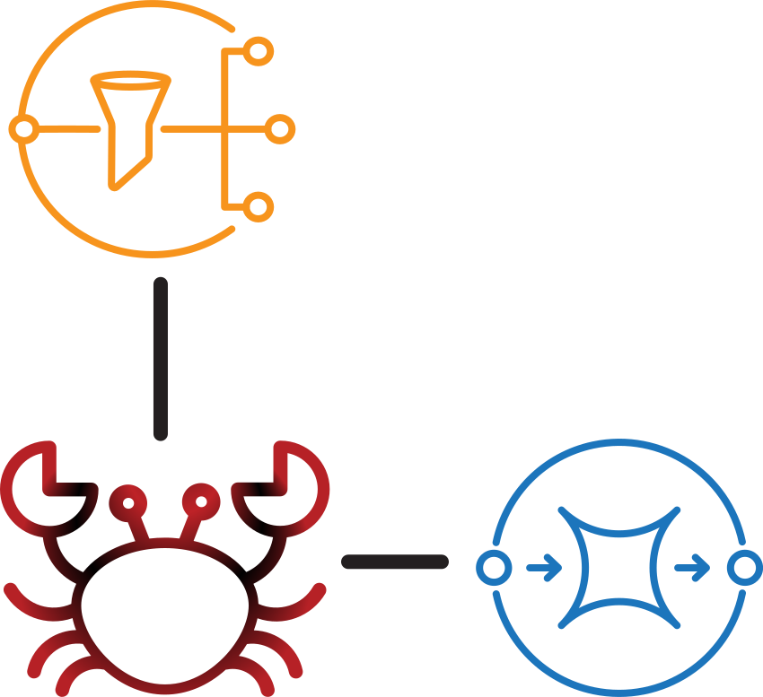

# **pinnothera**

<!--suppress HtmlDeprecatedAttribute -->
<p align="center"></p>

Named for the pea crab (Pinnothera Faba), the smallest crab in the world,
pinnothera is a tiny utility for ensuring a Kubernetes application's SNS/SQS
topic and queue subscriptions are configured as expected whenever the application
is deployed to a cluster.

## Use

`pinnothera` is intended to run _inside_ a Kubernetes cluster, but _will_ run locally
without fuss (provided your local environment has the expected environment variables set).

### In A Kubernetes Cluster

#### Prerequisites

`pinnothera` reads the intended SNS/SQS configuration for a given Kubernetes `Namespace`
from a `ConfigMap` named `sns-sqs-config` (located in the same namespace). To do so, the
`ConfigMap` must exist (obviously), but the `Namespace`'s `ServiceAccount` must also have
the appropriate permissions.

Ensure the required `ClusterRole` and `RoleBinding` exist in your local cluster:

```bash
kubectl apply -f k8s/cluster-role.yaml
kubectl apply -f k8s/role-binding.yaml -n NAMESPACE --overrides='{"subjects": [{"namespace": "NAMESPACE"}]}' 
```

#### As A Kubernetes `Job`

```bash
kubectl apply -f k8s/pinnothera-job.yaml -n NAMESPACE
```

> NOTE: If your cluster isn't running in EKS, ensure that you've edited
> [pinnothera-job.yaml](k8s/pinnothera-job.yaml) so that the correct
> AWS region and credentials are set in the container's environment.

#### As A "Bare" Kubernetes Pod

```bash
kubectl run -it configure-sns-sqs \
        --rm \
        --restart=Never \
        --env='AWS_DEFAULT_REGION=YOUR AWS REGION' \
        --env='AWS_ACCESS_KEY_ID=YOUR ACCESS KEY ID' \
        --env='AWS_SECRET_ACCESS_KEY=YOUR SECRET ACCESS KEY' \
        --image=docker.io/thewondersmith/pinnothera:latest 
```

### From Your Local Terminal

Either build your own binary using the instructions below, or download the appropriate
one for your local system from the releases, then -

```bash
export AWS_ENDPOINT='YOUR AWS ENDPOINT' \
AWS_ACCESS_KEY_ID='YOUR ACCESS KEY' \
AWS_DEFAULT_REGION='YOUR AWS REGION' \
AWS_SECRET_ACCESS_KEY='YOUR SECRET ACCESS KEY';

pinnothera
```

## Building

### For your local system

```bash
git clone https://github.com/the-wondersmith/pinnothera
cd pinnothera
cargo build --release
target/release/pinnothera
```

### For OCI / Docker Image(s)

#### Pre-compiling Binaries Locally

```bash
git clone https://github.com/the-wondersmith/pinnothera
cd pinnothera
OCI_TARGETS=(x86_64-unknown-linux-musl aarch-unknown-linux-musl)
rustup target add "${OCI_TARGETS}"
for TARGET in ${OCI_TARGETS[]@}; do cargo build --release --target "${TARGET}"; done
```

> NOTE: Building binaries for targets _other_ than your local system will
> most likely require you to have one or more cross-compilation
> toolchains installed. Check the [Dockerfile](Dockerfile) for relevant `apt`
> packages for Linux hosts. Check [crosstool-ng](https://crosstool-ng.github.io/)
> for macOS hosts. Windows hosts should... really know better, I suppose.

After cargo finishes, move the compiled binaries from `target/{ARCH}/release` into
the `artifacts/` directory, then run:

```bash
docker buildx build --push --platform='linux/arm64,linux/amd64' --tag='docker.io/{USERNAME}/pinnothera:{TAG}' --target='precompiled-pinn-image' -f Dockerfile .
```

#### Compiling Binaries w/ Docker

> WARNING: Compiling binaries using docker's `buildx` plugin generally relies on
> QEMU and has a tendency to result in weirdly flaky binaries. I haven't
> personally had very good luck doing things this way, but your mileage
> may vary.

Just run:

```bash
docker buildx build --push --platform='linux/arm64,linux/amd64' --tag='docker.io/{USERNAME}/pinnothera:{TAG}' --target='pinn-image' -f Dockerfile .
```

I *heavily* advise you to check the resulting binaries on native amd64 and arm64 hosts.
